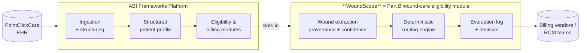
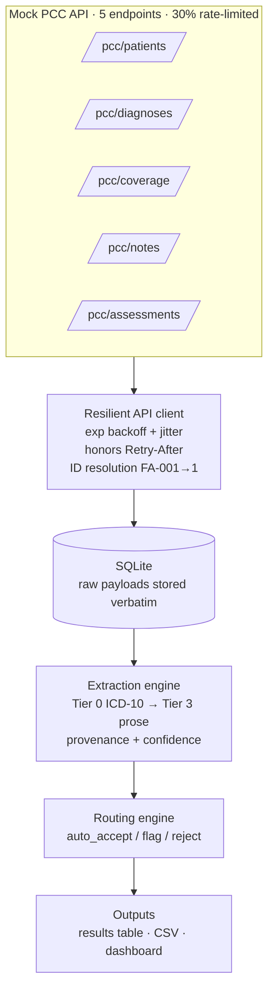
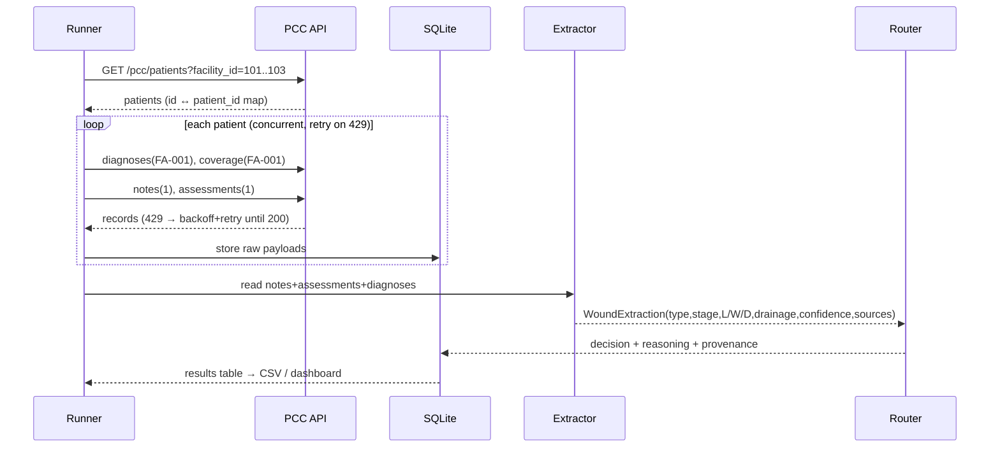
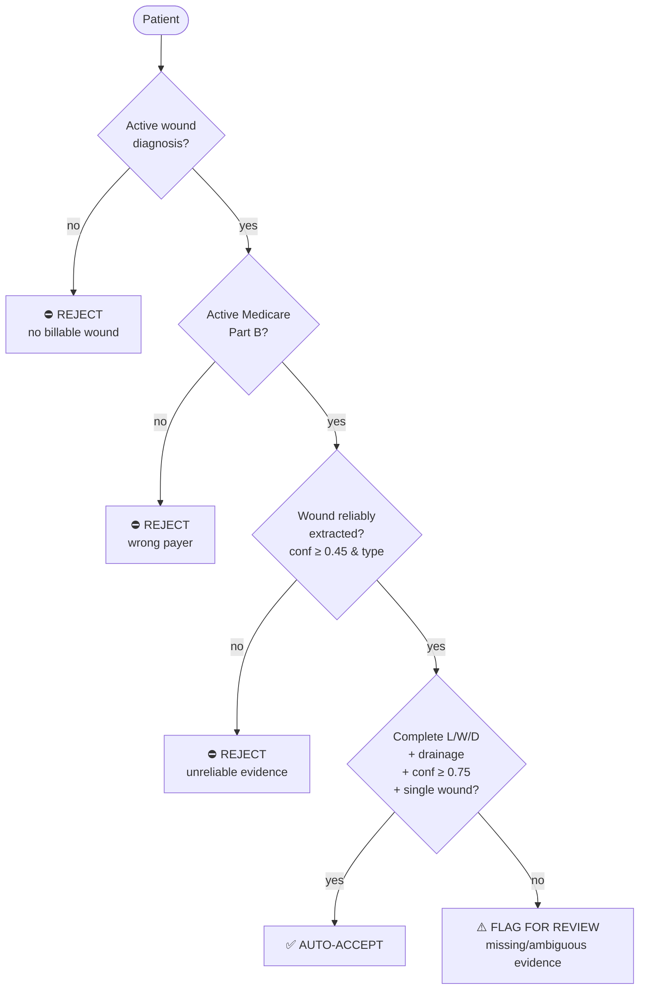
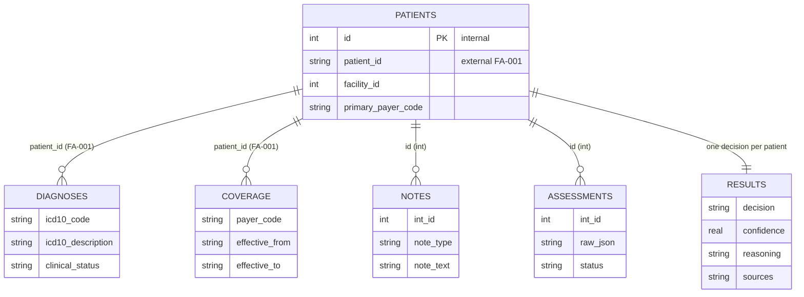

# WoundScope — End-to-End Design & Walkthrough

> Medicare **Part B wound-care billing eligibility**, automated.
> Built for the Pulse Foundry × ABI Frameworks Healthcare Data Hackathon.

This document is the single source of truth for what we built, how it works,
where it plugs into ABI's platform, the guardrails, and the edge cases.

---

## 1. What we are doing (in one paragraph)

Skilled nursing facilities leave money on the table because wound-care visits that
are **billable to Medicare Part B** are buried in fragmented EHR data and messy
clinical notes. WoundScope pulls every patient's records from the (PointClickCare)
EHR, **structures the wound evidence**, checks the three billing conditions, and
routes each patient to **auto-accept**, **flag-for-review**, or **reject** — each
decision deterministic, explainable, and backed by an evaluation log a billing
specialist (or auditor) can trust.

## 2. Why it matters to the business

ABI's own product promise: *"ABI pulls every patient record from PointClickCare,
structures it into a full patient profile, and delivers it to the vendors who need
it… catching missed billable services automatically."*

WoundScope **is that promise, executed for the wound-care Part B use case**:

- **Revenue recovery** — surfaces billable wound visits that would otherwise be missed.
- **Compliance** — never auto-bills on weak evidence (False Claims Act risk), and
  produces an audit trail for every decision.
- **Throughput** — billing staff review only the *ambiguous* cases, not all 300.

## 3. Where this gets incorporated (fit into ABI's platform)



WoundScope consumes the same PCC data ABI already ingests and emits **billing-ready
routing decisions + evaluation logs** in the shape ABI delivers to its vendors. It
is a drop-in module on ABI's eligibility layer, not a separate product.

## 4. System architecture



**Why SQLite in the middle:** the API fails 30% of calls, so we ingest once into a
durable store, then run extraction/routing **offline and re-runnably** — no
re-hitting the rate-limited API while we iterate on logic.

## 5. Data flow, end to end (sequence)



## 6. The eligibility decision (mirrors ABI's deterministic evaluation flow)



Each patient's path through this tree is recorded as a human-readable
**evaluation log** (the dashboard renders it node by node).

## 7. Extraction tiers (reliability-ordered)

| Tier | Source | Example | Reliability |
|------|--------|---------|-------------|
| 0 | Diagnosis ICD-10 | `L89.143 → Stage 3 Pressure Ulcer, Right hip` | authoritative (type + stage) |
| 1 | Assessment `raw_json` numeric fields | `length_cm: 3.2` | high |
| 2 | Labeled note fields | `Length: 2.9 cm` | high |
| 3 | Free-text prose | `8.0x3.5x0.2cm`, `Venous to R lower leg` | parsed, lower |

Every field stores **which tier it came from** (provenance) and a reliability
weight that feeds the confidence score:

```
confidence = 0.55·completeness(type,L,W,D) + 0.20·drainage + 0.25·source_reliability
             × 0.8 if multiple wounds detected (ambiguity penalty)
```

## 8. Data model



The **two-ID gotcha** is front and center: diagnoses/coverage key on the string
`patient_id` (`FA-001`); notes/assessments key on the integer `id` (`1`). We
resolve the mapping from `/pcc/patients` before any other call.

---

## 9. Guardrails — and how each is addressed

| Guardrail | Risk if missing | How WoundScope handles it |
|-----------|-----------------|---------------------------|
| **No auto-bill on weak evidence** | Improper Medicare claim → False Claims Act liability | `auto_accept` requires complete L/W/D + drainage **and** confidence ≥ 0.75 **and** a single wound; anything less → `flag_for_review`. |
| **Human-in-the-loop** | Silent wrong decisions | `flag_for_review` exists precisely so ambiguous cases get a human, not a guess. |
| **No fabricated measurements** | Hallucinated billing data | Extraction is deterministic (regex/structured). The optional LLM tier is schema-validated and falls back to `flag_for_review` on low model confidence — it can never invent a number that bills. |
| **Auditability / provenance** | Can't defend a decision in audit | Every field records its source tier; every decision stores a plain-English reason. The evaluation log reconstructs the whole path. |
| **Data completeness under failure** | Partial data → false rejects | 30% 429s are retried with backoff; a run drops **zero** records. Coverage/dx are never assumed from incomplete pulls. |
| **Payer correctness** | Billing Part B when bundled (HMO) | Routing checks `payer_code == MCB` **and** active dates; HMO/MCA/MCD are rejected with the actual payer named. |
| **Active-only clinical facts** | Billing a resolved wound | Only `clinical_status == active` diagnoses count; expired coverage (`effective_to` in past) is not "active." |
| **Idempotent / re-runnable** | Re-hitting API, inconsistent state | Raw payloads persisted; extraction/routing re-run offline with stable output. |
| **PHI handling** | Leaking patient data | Data stays local (SQLite); no third-party calls in the core pipeline. (If LLM tier is enabled, that's a documented, scoped exception.) |

---

## 10. Edge cases — enumerated and handled

**API / transport**
- **30% HTTP 429** → exponential backoff + jitter, honors `Retry-After`; retried to success.
- **422 (bad params) / 500 (server)** → surfaced with context, not silently swallowed.
- **Two patient-ID systems** → resolved via `/pcc/patients` before dependent calls.
- **`since` incremental sync** → supported on patients/notes/assessments for delta loads.

**Coverage**
- **Wrong payer (HMO/MCA/MCD)** → reject, payer named in reason.
- **Expired coverage** (`effective_to` in the past) → treated as inactive.
- **Multiple coverage rows** (e.g., MCB + HMO) → MCB active satisfies eligibility; logged.
- **`effective_to == null`** → active.

**Diagnosis**
- **No active wound dx** → reject.
- **Resolved/inactive wound** → not counted.
- **Wound implied by description but odd ICD** → matched by ICD prefix *or* "ulcer/wound" in description.

**Notes / assessments extraction**
- **`raw_json` not the documented flat schema** (real data nests wound text inside a "Wound narrative" answer) → parser handles both flat numeric fields and nested narratives.
- **Tight measurements** `8.0x3.5x0.2cm` (no spaces, single `cm`) → parsed.
- **Labeled vs dimensional** (`Length: 2.9 cm` vs `2.9 cm x 2.8 cm`) → both parsed.
- **Missing depth** (very common) → measurements incomplete → `flag_for_review`.
- **Abbreviations** `serosang`→serosanguineous, `Mod`→moderate, `PU`→pressure ulcer → normalized.
- **Stage `N/A` / unstageable / DTI** → handled without crashing; stage optional.
- **Multiple wounds in one note** → detected → ambiguity penalty + `flag_for_review` (can't attribute one bill).
- **Type missing in notes** → backfilled authoritatively from ICD-10 diagnosis (Tier 0).
- **Empty/no notes & assessments** → low confidence → reject (no evidence to bill).
- **Conflicting values across sources** → first authoritative source wins; provenance shows which.
- **Non-current records** (`is_current=false`) → current records preferred.
- **Drainage type but no amount (or vice-versa)** → partial drainage captured; completeness reflected in confidence.

**Routing**
- **Eligible on dx + Part B but thin documentation** → `flag_for_review` (never silently accepted or rejected).
- **High field-completeness but unknown wound type** → still requires a type (Tier 0 backfill) or routes to review/reject rather than auto-accept.

---

## 11. How to run (end to end)

```bash
pip install -r requirements.txt          # or use python3.13

python run.py all                        # ingest 300 → extract → route → CSV
python run.py all 15                     # quick demo subset
streamlit run app.py                     # ABI-styled dashboard
```

Stages are independent: `python run.py ingest` (API→DB), `process` (DB→results,
offline), `export` (CSV).

## 12. What we'd do next

- **LLM extraction tier** for the messiest Envive prose — schema-validated, with
  fallback to `flag_for_review` on low confidence (never auto-bills on a guess).
- **Confidence calibration** against a labeled sample to tune the 0.75 threshold.
- **Write-back** of decisions to ABI's profile store / vendor delivery format.
