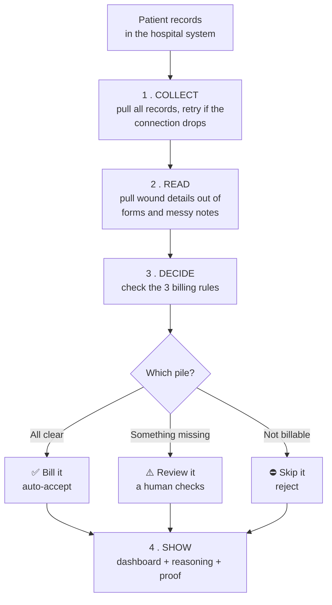
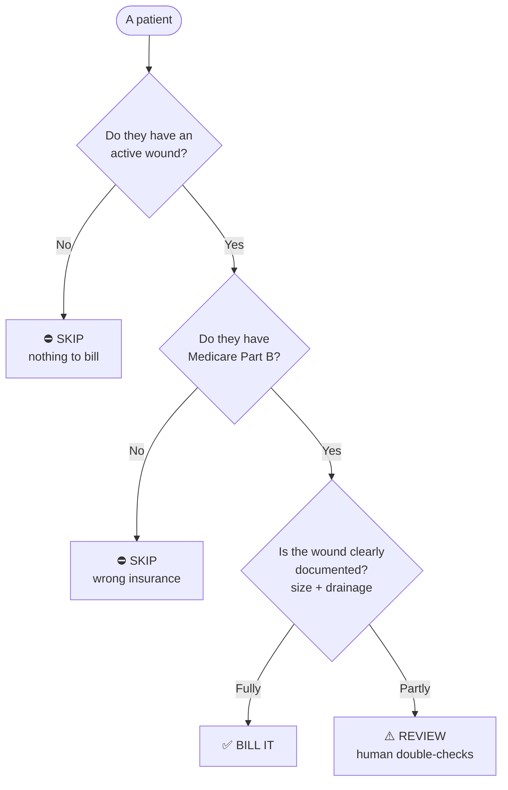
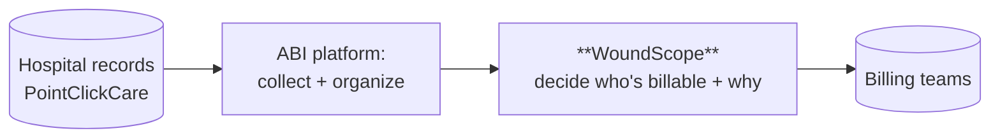

# WoundScope — A Plain-English Overview

*For everyone: billers, operators, founders, and judges. No technical background needed.*

---

## 1. The problem we're solving

Nursing homes treat patients with **wounds** (bed sores, diabetic foot ulcers,
and similar). When a wound is treated, the facility can often **bill Medicare**
to get paid for that care — but **only if three things are true**:

1. the patient actually has an **active wound**,
2. the patient has the right insurance: **Medicare Part B**, and
3. the wound is **properly documented** — its size (length, width, depth) and how
   much it's draining.

Here's the catch: that information is **scattered everywhere** — in insurance
records, in diagnosis codes, and in messy, hand-typed nurse notes full of
shorthand like *"Meas 8.0x3.5x0.2cm, mod serosang drainage."*

Today a human **biller** reads every patient's records by hand to figure out who
can be billed. It's slow, easy to get wrong, and **money gets left on the table**
when billable wounds are missed.

**In one sentence:** *We built software that reads all the messy records
automatically and tells the biller exactly which patients can be billed — and why.*

---

## 2. What we were asked to build

The hackathon challenge (from ABI Frameworks) was to build a pipeline that:

- **Pulls** patient data from a hospital records system (PointClickCare),
- **Survives** a flaky connection (the data source intentionally fails ~30% of
  requests, to mimic the real world),
- **Reads** the wound details out of both tidy forms and messy free-text notes,
- **Decides** for each patient: bill it, review it, or skip it,
- **Shows** the result in a way a non-technical biller can trust and act on.

---

## 3. What we built (in plain words)

A tool called **WoundScope** that does the whole job end to end:

| Step | What it does | In everyday terms |
|---|---|---|
| **Collect** | Pulls every patient's records, retrying when the connection drops | Like patiently re-dialing a busy phone line until it picks up — and never losing a page |
| **Read** | Extracts wound type, size, and drainage from forms *and* messy notes | Like a careful assistant who can read a doctor's shorthand |
| **Decide** | Checks the 3 billing rules and sorts each patient into one of three piles | Like a triage nurse sorting patients by urgency |
| **Show** | Presents everything in a clean dashboard with the reasoning behind each call | Like a one-page summary a manager can sign off on |

And every answer comes with **proof** — you can see the exact words in the
original note that led to each decision.

---

## 4. How it works — a patient's journey through the system

**In words:** records go in on the left, get collected and read, run through the
billing rules, land in one of three piles, and show up on a dashboard with the
reasoning — all automatically.

---

## 5. The three decisions, explained with examples

| Decision | What it means | Example |
|---|---|---|
| ✅ **Bill it** | All three rules clearly met — safe to send to billing | *"Diabetic foot ulcer, 5.5×2.0×1.0 cm, heavy drainage, Medicare Part B active."* |
| ⚠️ **Review it** | Eligible, but something's incomplete — a person should look | *"Has the wound and the right insurance, but the **depth** wasn't written down."* |
| ⛔ **Skip it** | Can't be billed | *"Patient has an HMO, not Medicare Part B."* |

We deliberately **only auto-bill when we're confident**. If anything is unclear,
it goes to a human — because wrongly billing Medicare is a serious problem.

---

## 6. The things that make it trustworthy

- **Proof for every answer.** Click any patient and see the exact sentence from
  the original note behind each number. Nothing is a black box.
- **It shows its reasoning.** Each decision lists which rules passed and which
  failed, in plain English.
- **It catches patients with *two* wounds.** Nurse notes often mention two wounds
  in one paragraph (e.g., a foot ulcer *and* an ankle wound). The tool spots both
  and flags them so **each wound gets billed** — instead of quietly missing one.
- **It never makes up numbers.** If a measurement isn't in the records, it says
  "missing" and sends the patient to review — it does not guess.
- **It protects patient privacy.** Names are hidden by default (you reveal them
  only when needed), everything runs locally, and every decision is logged — in
  line with healthcare privacy rules (HIPAA). *Note: the demo uses fake patients,
  so no real private data is involved.*

---

## 7. How this fits the company (ABI Frameworks)

ABI's business is: *pull patient records from PointClickCare, organize them, and
hand billing-ready information to the teams who need it.* **WoundScope is exactly
that, for the wound-care billing case** — it slots straight into what ABI already
does and automatically surfaces billable care that would otherwise be missed.

---

## 8. Why our version is strong (the team merge)

Our team built several versions; this one combines the **best part of each**:

- The **most complete medical-code coverage** (so we catch more billable wound
  types — burns, surgical wounds, and more).
- The smartest **messy-note reader** that handles **multiple wounds** and repairs
  garbled text (e.g., *"Rightlowerle"* → *"right lower leg"*).
- Our own **careful billing rules**, **privacy protections**, and a **dashboard
  styled to feel like ABI's own product.**

The result catches **more** billable care, makes **fewer** mistakes, and **proves**
every decision.

---

## 9. The result (on 300 sample patients)

- **300 patients** processed automatically, with **zero records lost** despite the
  flaky connection.
- Sorted into: **✅ bill it**, **⚠️ review it**, **⛔ skip it** — each with reasoning
  and proof.
- A biller now reviews **only the handful of unclear cases** instead of reading all
  300 by hand.

---

## 10. Glossary (plain definitions)

| Term | Simple meaning |
|---|---|
| **Medicare Part B** | A type of government insurance that pays for outpatient wound care |
| **PointClickCare (PCC)** | The software where nursing homes keep patient records |
| **Wound documentation** | Writing down the wound's size and drainage so it can be billed |
| **Billable** | Allowed to be charged to insurance |
| **Pipeline** | An automatic assembly line for data: collect → read → decide → show |
| **Rate-limited** | The data source only answers so many requests at a time and refuses the rest |
| **PHI** | Protected Health Information — private patient data the law requires us to safeguard |
| **HIPAA** | The U.S. law that sets rules for handling patient data |
| **Provenance / evidence** | Proof showing exactly where each piece of information came from |
